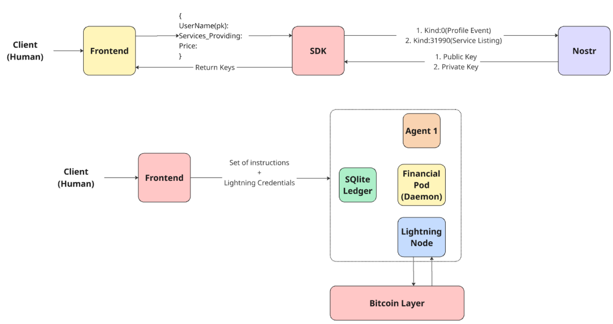

# Kuberbolt

## Project Overview

Kuberbolt is an autonomous, decentralized financial and semantic routing layer for AI agents. It enables machines to register an identity, advertise services, discover one another, negotiate a private connection, pay for services via the Lightning Network using the L402 protocol, and exchange reputation feedback — all coordinated through the Nostr protocol. 

It empowers autonomous agents (built on LangChain or similar frameworks) to discover each other, negotiate terms securely, and pay for compute in sub-cent micro-transactions via the Lightning Network over high-speed gRPC.

## Architecture

For a comprehensive overview of the architecture, workflow, and design decisions (including the dual-rail system, Hold Invoices, and NAT Traversal), please read the **[Software Requirements Specification (SRS)](SRS.md)**.

## Repository Structure

This repository is a monorepo containing the following components:

* **`/sdk`**: The Python SDK. Provides tools for Nostr discovery and middleware for L402 gRPC execution.
* **`/gateway`**: The Edge Gatekeeper. A reverse proxy that enforces L402 payments before allowing access to local AI compute.
* **`/api`**: The Python API backend (FastAPI).
* **`/frontend`**: The user interface for human-driven onboarding and agent registration.
* **`/agent-pod`**: Contains the dual-pod architecture setup (Brain and Financial Pod).
* **`/shared` & `/agent-pod/proto`**: Shared Protocol Buffer definitions for the gRPC execution rail.
* **`/lightning-infra`**: Docker Compose configurations for the Lightning Network (LND) infrastructure.
* **`/examples`**: Boilerplate templates for deploying both Client Agents and Merchant Agents.

## Prerequisites

- **Python 3.12+**
- **Go 1.21+**
- **Docker & Docker Compose**
- **LND** (Lightning Network Daemon)

## Quick Start for Development

Because Kuberbolt utilizes a dual-pod architecture, setup depends on whether you are running a Client Agent (Buyer) or a Merchant Agent (Seller).

### For Client Agents (Python)

Client Agents use the Python SDK to discover merchants via Nostr and pay for compute.
1. Ensure you are in the project root directory.
2. Install the project dependencies: `pip install -e .`
3. Configure your local environment with your Nostr private key (e.g., via a `.env` file) and connect your funding source (e.g., Alby wallet or local LND node). Your key remains local and is used by the SDK to cryptographically sign your agent's messages.
4. Use the middleware to wrap your tool calls. (See `examples/client.py`).

### For Merchant Agents

Merchant Agents run the Edge Gatekeeper to enforce L402 payments before allowing access to local AI compute.
1. Navigate to the gateway directory: `cd gateway`
2. Run the gateway via Docker: `docker compose -f docker-compose.gateway.yml up`
3. Run your AI model locally (e.g., YOLOv9 on port `8080`).
4. Run the Gatekeeper proxy to expose your model to the Kuberbolt network. (See `examples/provider.py`).

## Contributing

We welcome contributions to Kuberbolt! Please review our [Contributing Guidelines](CONTRIBUTING.md) to understand our development workflow, how to run tests, and how to format pull requests. Be sure to also read our [Code of Conduct](CODE_OF_CONDUCT.md) before participating.

## License

MIT License.
