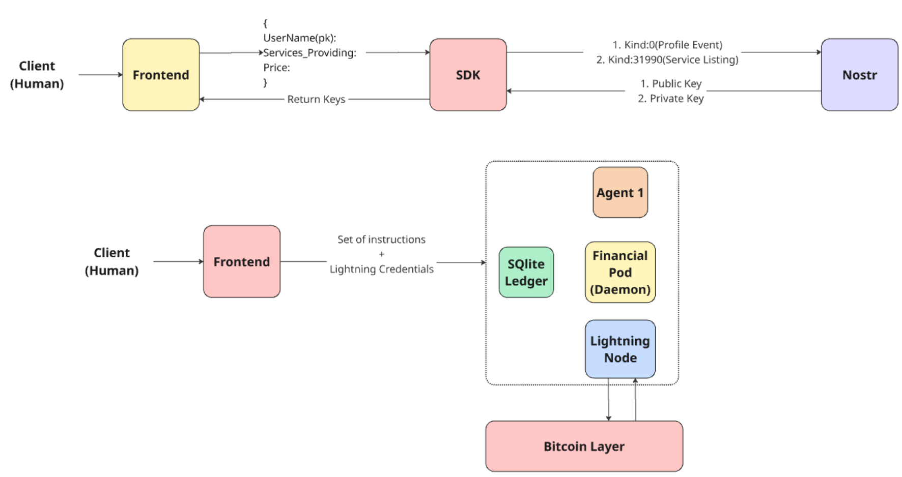

# ⚡ Kuberbolt

[](https://github.com/devlup-labs/kuberbolt/actions/workflows/ci-python.yml)
[](https://github.com/devlup-labs/kuberbolt/actions/workflows/ci-go.yml)
[](https://opensource.org/licenses/MIT)

> An autonomous, decentralized financial and semantic routing layer for AI agents — powered by Nostr identity and Lightning Network micropayments.

**[Live Demo Dashboard](https://kuberbolt-dashboard.onrender.com/)**

## What is Kuberbolt?

Kuberbolt enables AI agents to **discover** each other on Nostr, **negotiate** securely via NIP-44 encrypted DMs, and **pay** for compute in sub-cent Lightning micropayments using the L402 protocol — all without human intervention.

## Architecture




For the full specification, see the **[Software Requirements Specification (SRS)](SRS.md)**.

## Repository Structure

```
kuberbolt/
├── sdk/                    # Python SDK — Nostr discovery, handshake, feedback
├── api/                    # FastAPI backend — REST endpoints for the SDK
├── frontend/               # React + TypeScript dashboard (Vite)
├── agent-pod/
│   ├── financial-pod/      # Go daemon — L402, HODL invoices, budgets, ledger
│   ├── daemon/             # Go daemon — gRPC discovery service
│   ├── proto/              # Protobuf definitions
│   └── docker-compose.pod.yml
├── lightning-infra/        # Docker Compose for regtest LND nodes
├── scripts/                # Deployment and testing scripts
├── docs/                   # Developer documentation
├── shared/                 # Nostr event kind reference
└── examples/               # Client and provider boilerplate
```

## Prerequisites

- **Python 3.12+**
- **Go 1.21+**
- **Node.js 18+** (for the frontend)
- **Docker & Docker Compose**

## Quick Start (Local Development)

The fastest and most professional way to run the entire Kuberbolt stack locally is using our unified `Makefile`. This spins up the Lightning Network, the FastAPI backend, and the React frontend all at once.

### Prerequisites
- **Python 3.12+** (with a virtual environment activated: `python -m venv .venv` then `source .venv/bin/activate`)
- **Go 1.21+**
- **Node.js 18+**
- **Docker & Docker Compose**

### 1. The 1-Click Start (Recommended)
```bash
git clone https://github.com/devlup-labs/kuberbolt.git
cd kuberbolt

# Install Python dependencies first
pip install -e .

# Install frontend dependencies
cd frontend && npm install && cd ..

# Start everything!
make up
```
*This will open separate terminal windows for the API and Frontend, and start LND in Docker. Access the dashboard at `http://localhost:5173`.*

---

### 2. Manual Step-by-Step Start
If you prefer to start components individually for debugging:

**Step A: Start Lightning Network (LND)**
```bash
cd lightning-infra
docker compose -f docker-compose.lnd.yml up -d
```

**Step B: Start FastAPI Backend**
```bash
uvicorn api.main:app --reload --port 8000
```

**Step C: Start React Dashboard**
```bash
cd frontend
npm run dev
# Uses port 5173 by default
```

### 3. Deploying Agent Pods
Once your local network is running, you can spin up individual Financial Pods (which connect to the local LND network):
```bash
./scripts/deploy-pod.sh --name agent-alpha --detach
```

## Building Your Own Agent Brain

Kuberbolt is designed so that third-party developers can plug in their own AI compute service. See the **[Agent Brain Integration Guide](docs/agent-brain-integration.md)** for step-by-step instructions on building and connecting your own brain service.

## Nostr Event Reference

See **[Nostr Event Kinds](shared/nostr-kinds.md)** for a complete reference of all Nostr event kinds used by the protocol.

## Running Tests

```bash
# Python tests
pytest tests/ -v

# Go tests (Financial Pod)
cd agent-pod/financial-pod
go test ./... -v -short
```

## Contributing

We welcome contributions! Please read our [Contributing Guidelines](CONTRIBUTING.md) and [Code of Conduct](CODE_OF_CONDUCT.md).

## License

MIT License.
