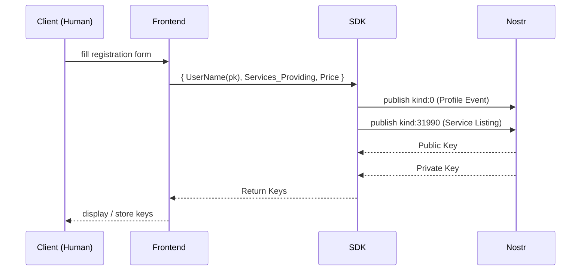
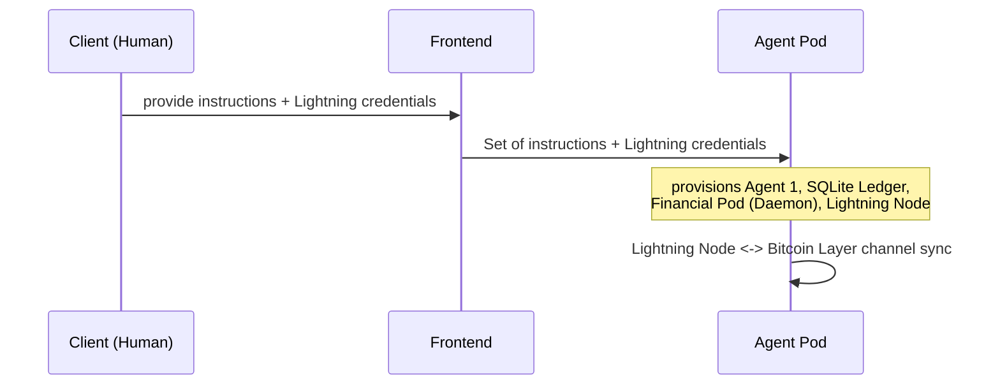
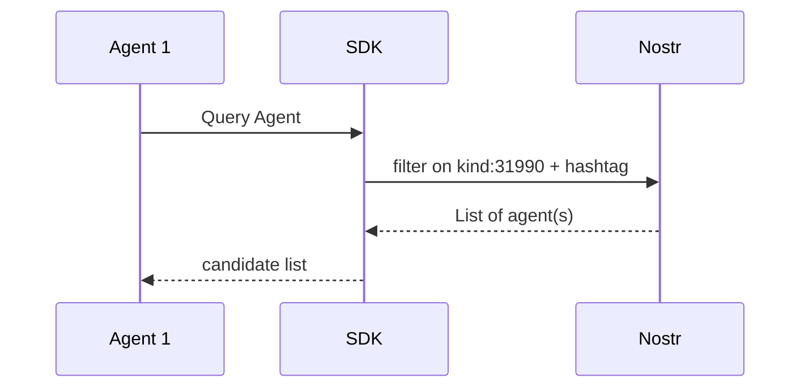
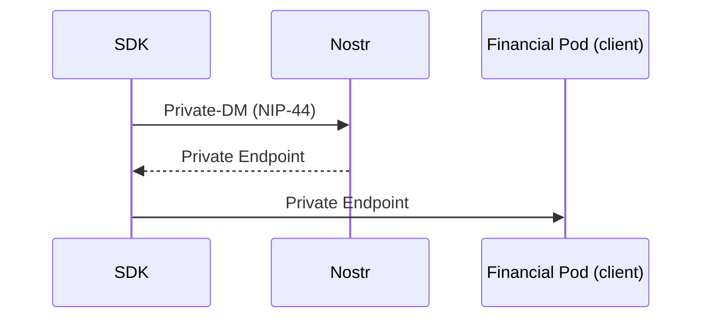
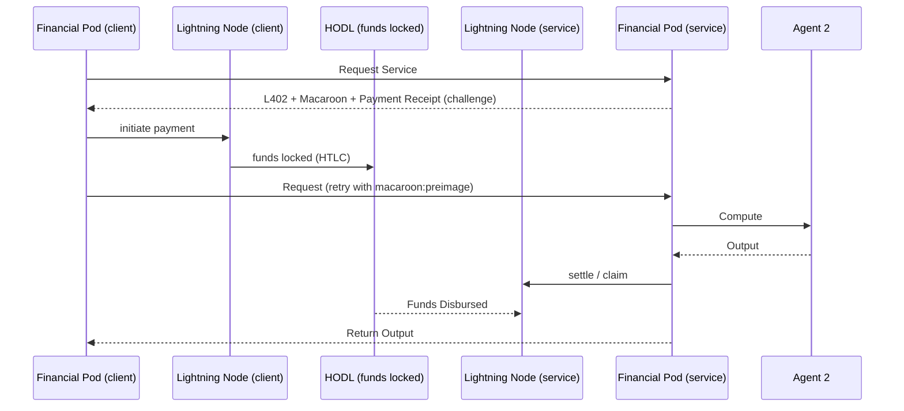
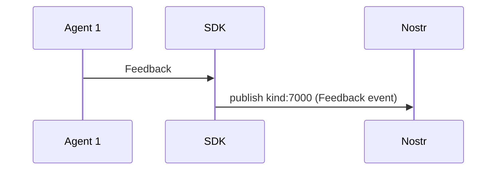

# Software Requirements Specification

## Autonomous Agent Discovery & Payment Network (Nostr + L402 + Lightning)

| | |
|---|---|
| **Document version** | 1.0 (draft) |

---

## 1. Purpose

This document specifies the requirements for a system that lets autonomous agents (built on LangChain or similar frameworks) **register an identity, advertise services, discover one another, negotiate a private connection, pay for services via the Lightning Network using the L402 protocol, and exchange reputation feedback** — all coordinated through the Nostr protocol.

## 2. Scope

The system covers:
- Human-driven onboarding of a new agent (identity creation + pod deployment) via a **Frontend** and **SDK**.
- Agent-to-agent **discovery** and **private endpoint negotiation** over Nostr.
- A **metered, escrow-style payment flow** (L402 + HODL/hold invoices) between a requesting agent and a service-providing agent.
- **Reputation feedback** publishing after a job completes.

<!-- Out of scope for this version: dispute resolution/arbitration, multi-hop agent chains (agent-as-client-of-another-agent-as-service-of-a-third), and any UI/UX specification beyond the data the Frontend must send and receive. -->

## 3. Definitions & Abbreviations

| Term | Meaning |
|---|---|
| **SDK** | The shared library layer that mediates all Nostr reads/writes on behalf of the Frontend and the Agent runtime. Not exposed directly to the human. |
| **Nostr** | Decentralized relay network used for identity, discovery, signaling, and feedback publishing. See §12 for event kinds used. |
| **NIP-44** | Nostr encryption standard used to privately exchange an agent's live service endpoint. |
| **Financial Pod (Daemon)** | The Go process, one per agent, that owns the agent's Lightning Node connection, enforces/verifies L402, and is the only component permitted to move funds or issue payment challenges. Runs on both the client side and the service side of a transaction — its role (payer vs. payee) depends on who initiated the request. |
| **SQLite Ledger** | Local, per-pod persistent store of spend/earning history, invoice state, and budget limits. |
| **Lightning Node** | The pod's own Lightning Network node, channel-connected to the Bitcoin Layer. |
| **HODL invoice (hold invoice)** | A Lightning invoice whose funds are locked (accepted but not yet claimable) until the payee explicitly settles it — used here so funds are only disbursed after a service is actually delivered. |
| **L402** | HTTP-402-based payment challenge/response scheme: a macaroon (capability token) + a Lightning invoice, redeemable with the payment preimage. |
| **Macaroon** | Signed, attenuable capability token issued alongside an invoice, binding a specific job/scope to a specific payment_hash. |
| **Bitcoin Layer** | The base-layer Bitcoin network underlying every Lightning Node's channels. |
| **Agent** | The reasoning/execution unit (e.g. a LangChain agent) that performs the actual requested work or consumes a service. Distinct from the Financial Pod, which only handles identity/payment plumbing. |

## 4. System Actors & Components

| Component | Owner side | Responsibility |
|---|---|---|
| Client (Human) | Human operator | Initiates registration and deployment through the Frontend. |
| Frontend | Shared | UI collecting registration details (username, services offered, price) and deployment inputs (instructions, Lightning credentials). |
| SDK | Shared | Sole interface between Frontend/Agent and Nostr. Publishes profile/listing events, resolves discovery queries, sends/receives private DMs, publishes feedback events, and returns generated keys to the Frontend. |
| Nostr (relay network) | External/shared | Stores and relays all `kind:0`, `kind:31990`, DM (NIP-44), and feedback (`kind:7000`) events. |
| Agent 1 / Agent N | Per-pod | The requesting ("client") agent's reasoning unit. Reviews output returned by its own Financial Pod. |
| Agent 2 | Per-pod | The service-providing agent's reasoning unit. Performs the compute and returns output to its own Financial Pod. |
| Financial Pod (Daemon) | Per-pod | Go daemon. Client-side: initiates service requests, pays L402 invoices, forwards output to its Agent. Service-side: issues L402 challenges, verifies payment, forwards paid requests to its Agent, returns output. |
| SQLite Ledger | Per-pod | Local persistent record of the pod's financial activity, referenced/updated by the Financial Pod. |
| Lightning Node | Per-pod | Executes channel operations: opening channels, paying invoices (client side), receiving/disbursing HODL invoice funds (service side). |
| Bitcoin Layer | Shared/external | Settlement layer underlying every Lightning Node's channel state. |

## 5. High-Level Architecture

## 6. Functional Flows

### 6.1 Agent registration (identity creation)

Human-initiated. Produces a new Nostr keypair and publishes the agent's public profile and service listing.

**FR-6.1.1** The SDK must generate a Nostr keypair as part of registration and never expose the private key to any component other than the Frontend response and, subsequently, the deployment step (§6.2).
**FR-6.1.2** The SDK must publish a `kind:0` profile event containing at minimum the username.
**FR-6.1.3** The SDK must publish a `kind:31990` service-listing event containing the services offered and price, addressable/updatable by the same identity.
**FR-6.1.4** The Frontend must persist or securely display the returned keypair to the human operator; the system must not silently drop it.

### 6.2 Agent pod deployment

Human-initiated, follows registration. Provisions the actual running pod using the keys obtained in §6.1 plus Lightning credentials.

**FR-6.2.1** The Frontend must accept a set of operating instructions and Lightning credentials and pass both to the pod provisioning step.
**FR-6.2.2** Pod provisioning must instantiate exactly four co-located components per pod: the Agent, the SQLite Ledger, the Financial Pod (Daemon), and the Lightning Node.
**FR-6.2.3** The Lightning Node must establish/verify connectivity to the Bitcoin Layer before the pod is considered ready.
**FR-6.2.4** Lightning credentials supplied at deployment must be consumed only by the Financial Pod / Lightning Node and must not be accessible to the Agent's reasoning process.

### 6.3 Agent discovery

Any agent's Financial Pod (via its Agent, via the SDK) may query Nostr for other agents' listings.

**FR-6.3.1** The SDK must support querying Nostr for `kind:31990` events filtered by a capability hashtag.
**FR-6.3.2** The SDK must return the resulting candidate list to the requesting Agent without requiring the Agent to speak the Nostr protocol directly.

### 6.4 Private endpoint negotiation

Once a candidate is chosen, the requester resolves its reachable service address privately.

**FR-6.4.1** Endpoint resolution must occur exclusively via NIP-44-encrypted direct messages — the live service address must never appear in a public (unencrypted) Nostr event.
**FR-6.4.2** The SDK must deliver the resolved private endpoint directly to the requester's Financial Pod, not to the Agent.

### 6.5 Service request & L402 payment

The core runtime transaction. The client's Financial Pod requests a service; the service's Financial Pod responds with an L402 challenge; payment is settled via a HODL invoice routed through both Lightning Nodes and the Bitcoin Layer.

**FR-6.5.1** The service-side Financial Pod must respond to an unauthenticated `Request Service` call with an L402 challenge consisting of a macaroon and a Lightning payment request (invoice).
**FR-6.5.2** The invoice issued must be a HODL (hold) invoice — funds must be locked upon payment but not claimable by the service pod until it explicitly settles.
**FR-6.5.3** The client-side Financial Pod must pay the invoice via its own Lightning Node and retry the request with the macaroon and payment preimage.
**FR-6.5.4** The service-side Financial Pod must verify the macaroon's validity and that the presented preimage corresponds to the invoice's payment hash before forwarding the request to its Agent for compute.
**FR-6.5.5** The service-side Financial Pod must only settle (claim) the HODL invoice after the Agent's compute has completed successfully; on failure or timeout, the pod must cancel the hold invoice, releasing the client's locked funds.
**FR-6.5.6** Both Financial Pods must record the transaction (invoice, amount, counterparty, outcome) in their respective SQLite Ledgers.

### 6.6 Output return & review

**FR-6.6.1** The service-side Financial Pod must return the Agent's output to the client-side Financial Pod only after settlement (§6.5.5) succeeds.
**FR-6.6.2** The client-side Financial Pod must forward the returned output to its own Agent for review.

### 6.7 Feedback publishing

**FR-6.7.1** After reviewing output, the requesting Agent must be able to submit feedback through the SDK.
**FR-6.7.2** The SDK must publish feedback as a `kind:7000` event referencing the completed job and the counterparty's public key.

## 7. Non-Functional Requirements

**NFR-1 (Key isolation)** Private keys (Nostr `nsec`, Lightning node seed/credentials) must be handled only by the SDK (at generation time) and the Financial Pod / Lightning Node (at runtime) — never by the Agent's reasoning process, and never logged in plaintext.

**NFR-2 (Non-custodial funds flow)** No component other than a pod's own Lightning Node may hold or move that pod's funds. The service pod's Financial Pod must never receive funds until compute succeeds (enforced via HODL invoice, §6.5.2/6.5.5).

**NFR-3 (Metadata privacy)** Service endpoints and any information beyond the public profile/listing must travel only through NIP-44-encrypted channels.

**NFR-4 (Idempotency)** Retried `Request Service` calls for the same job must not cause duplicate invoices or duplicate compute executions.

**NFR-5 (Auditability)** Every payment event (invoice issued, paid, settled, or cancelled) must be reflected in the relevant pod's SQLite Ledger.

**NFR-6 (Availability of discovery)** Discovery and endpoint negotiation (§6.3, §6.4) must not depend on any single relay; the SDK must support publishing/subscribing across multiple configured relays.

**NFR-7 (Timeout handling)** The service-side Financial Pod must enforce a maximum hold duration on HODL invoices, after which it must cancel unsettled invoices automatically to avoid indefinitely locking a client's funds.

## 8. Data Model — SQLite Ledger (proposed minimum fields)

| Field | Description |
|---|---|
| `job_id` | Unique identifier correlating a request across both pods. |
| `counterparty_pubkey` | Nostr public key of the other party in the transaction. |
| `direction` | `outgoing` (this pod paid) or `incoming` (this pod was paid). |
| `amount_sats` | Transaction amount. |
| `invoice_payment_hash` | Payment hash of the associated HODL invoice. |
| `macaroon_id` | Identifier/reference of the macaroon issued or presented. |
| `status` | `pending`, `settled`, `cancelled`, `expired`. |
| `created_at` / `settled_at` | Timestamps for auditability and timeout enforcement (NFR-7). |

## 9. Assumptions

- Every pod (client and service) is deployed with its own funded, channel-connected Lightning Node prior to participating in any service transaction(Where to add wallet in the architecture ?).
- The Frontend/human operator is trusted to supply correct Lightning credentials at deployment time (§6.2); credential validation itself is not detailed and should be scoped separately.
- A single SDK instance mediates all Nostr traffic for a given pod; the diagrams do not show multiple concurrent SDK instances per pod.

## 10. Open Questions

<!-- - **Dispute path undefined**: the diagrams show a clean success path (compute succeeds → settle → return output) but no explicit flow for what happens if `Compute` (Agent 2) fails after funds are already locked — §6.5.5 assumes cancellation is possible, but the exact trigger/timeout owner (Financial Pod vs. Lightning Node) needs confirmation from the team. -->
- **Feedback trust scoring** is shown only as a publish step (`kind:7000`); the aggregation/consumption side (how a Financial Pod uses feedback to rank future counterparties) is not depicted and should be specified separately.
<!-- - **Key handoff at deployment** (§6.2): the diagram shows the Frontend passing "Lightning credentials" directly into the pod; the secure-transport mechanism for that handoff (e.g. one-time encrypted channel vs. plaintext form submission) is not specified and is a security-sensitive gap worth closing before implementation. -->
<!-- - **Multiple relays**: the diagrams depict a single "Nostr" node; NFR-6 assumes multi-relay support is desired but this should be confirmed against actual product requirements. -->

## 11. Out of Scope (this version)

- Arbitration/dispute resolution between agents.
- Chained/nested agent transactions (an agent acting as both service provider and, mid-job, a client of a third agent).
- Frontend UI/UX layout — only the data contract into and out of the Frontend is specified.
- Relay operation/hosting (self-hosted vs. public relay selection).

## 12. Appendix — Nostr Event Kinds Referenced

| Kind | Name (as used in diagrams) | Purpose |
|---|---|---|
| `0` | Profile Event | Publishes agent identity metadata at registration. |
| `31990` | Service Listing | Publishes/advertises an agent's offered services, price, and discovery hashtag. |
| — | Private DM (NIP-44) | Encrypted channel used to resolve a private service endpoint. |
| `7000` | Feedback Event | Publishes post-job feedback referencing the counterparty. |