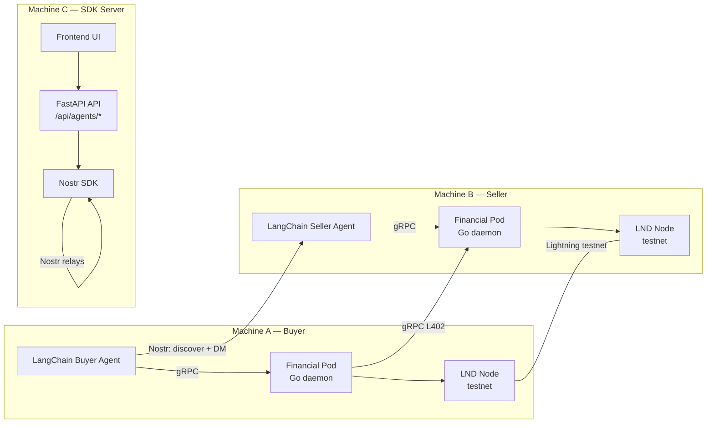
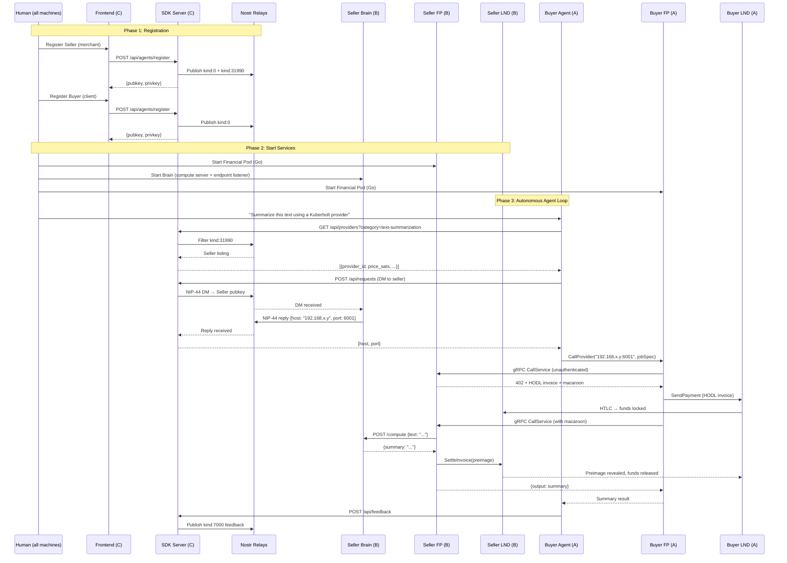

# Kuberbolt End-to-End System Test Plan

## 🎯 Objective

Run a **full buyer↔seller transaction loop** across 3 physical machines on the same WiFi:

| Machine | Role | What it runs |
|---------|------|-------------|
| **Machine A** | Buyer Agent | LangChain agent + LND node (testnet) + Financial Pod |
| **Machine B** | Seller Agent | LangChain agent + LND node (testnet) + Financial Pod + Gemini-powered text summarization service |
| **Machine C** | SDK Server | FastAPI API server + shared bitcoind (testnet, optional) |

**End-to-end flow:** Manual registration via frontend → Seller advertises "text-summarization" on Nostr → Buyer discovers seller via Nostr → Buyer DMs seller for private endpoint (IP:port) → Buyer's Financial Pod sends L402-gated gRPC call → HODL invoice → Compute → Settle → Feedback

---

## 📐 Architecture Overview



---

## Phase 0: Prerequisites & Environment Setup

### 0.1 All Machines

- [ ] Python 3.11+ installed
- [ ] Go 1.21+ installed (Machine A & B)
- [ ] Docker & Docker Compose installed
- [ ] All machines connected to the same WiFi network
- [ ] Note down each machine's local IP: `ipconfig getifaddr en0` (macOS)

### 0.2 Machine C — SDK Server

> [!IMPORTANT]
> The SDK server must be reachable from Machines A and B via LAN IP.

```bash
# Clone and checkout dev
git clone <repo> && cd kuber-uday && git checkout dev && git pull

# Set up Python venv
python3 -m venv .venv && source .venv/bin/activate
pip install -e sdk/python/
pip install -r requirements.txt   # FastAPI, uvicorn, nostr-sdk, etc.

# Create .env
cat > .env << 'EOF'
FRONTEND_ORIGIN=*
DEFAULT_RELAYS=wss://relay.damus.io,wss://nos.lol
GOOGLE_API_KEY=<your-gemini-api-key>
EOF

# Start the API server bound to 0.0.0.0
uvicorn api.main:app --host 0.0.0.0 --port 8000
```

### 0.3 Machine A — Buyer LND (Testnet)

```bash
# Option 1: Docker LND on testnet
docker run -d --name buyer-lnd \
  -p 10009:10009 -p 8080:8080 -p 9735:9735 \
  -v $(pwd)/buyer-lnd-data:/root/.lnd \
  lightninglabs/lnd:v0.17.4-beta \
  --noseedbackup \
  --alias=buyer \
  --bitcoin.active \
  --bitcoin.testnet \
  --bitcoin.node=neutrino \
  --neutrino.connect=faucet.lightning.community \
  --rpclisten=0.0.0.0:10009 \
  --restlisten=0.0.0.0:8080 \
  --listen=0.0.0.0:9735 \
  --tlsextradomain=<MACHINE_A_IP> \
  --tlsextradomain=localhost

# Wait for sync
docker exec buyer-lnd lncli --network=testnet getinfo

# Create wallet address and fund from testnet faucet
docker exec buyer-lnd lncli --network=testnet newaddress p2wkh
# → Fund this address from https://testnet-faucet.com or https://bitcoinfaucet.uo1.net/
```

### 0.4 Machine B — Seller LND (Testnet)

```bash
# Same as Machine A but different alias
docker run -d --name seller-lnd \
  -p 10009:10009 -p 8080:8080 -p 9735:9735 \
  -v $(pwd)/seller-lnd-data:/root/.lnd \
  lightninglabs/lnd:v0.17.4-beta \
  --noseedbackup \
  --alias=seller \
  --bitcoin.active \
  --bitcoin.testnet \
  --bitcoin.node=neutrino \
  --neutrino.connect=faucet.lightning.community \
  --rpclisten=0.0.0.0:10009 \
  --restlisten=0.0.0.0:8080 \
  --listen=0.0.0.0:9735 \
  --tlsextradomain=<MACHINE_B_IP> \
  --tlsextradomain=localhost

# Wait for sync, create address, fund it
```

### 0.5 Open Lightning Channel (Buyer → Seller)

```bash
# On Machine A (buyer):
# Get seller's LND pubkey from Machine B
docker exec seller-lnd lncli --network=testnet getinfo | grep identity_pubkey

# Connect to seller node
docker exec buyer-lnd lncli --network=testnet connect <SELLER_LND_PUBKEY>@<MACHINE_B_IP>:9735

# Open channel with enough capacity
docker exec buyer-lnd lncli --network=testnet openchannel \
  --node_key=<SELLER_LND_PUBKEY> \
  --local_amt=500000

# Wait for channel to confirm (6 blocks on testnet ≈ 60 min)
docker exec buyer-lnd lncli --network=testnet listchannels
```

---

## Phase 1: Manual Agent Registration (Frontend → SDK Server)

### What needs to happen

Both agents register on the SDK server (Machine C) via the existing frontend UI. The frontend calls `POST /api/agents/register` which generates Nostr keypairs and publishes `kind:0` (profile) and `kind:31990` (service listing) events.

### 1.1 Register the Seller (Machine B) — Merchant Role

Via the frontend UI (or curl against the SDK server):

```bash
curl -X POST http://<MACHINE_C_IP>:8000/api/agents/register \
  -H "Content-Type: application/json" \
  -d '{
    "role": "merchant",
    "display_name": "Kuberbolt Summarizer",
    "about": "AI text summarization agent powered by Gemini",
    "lightning": {
      "node_pubkey": "<SELLER_LND_PUBKEY>",
      "lightning_address": "seller@testnet"
    },
    "service": {
      "service_name": "Text Summarization",
      "service_description": "Summarize any text using Google Gemini",
      "category": "text-summarization",
      "price_sats": 100,
      "price_unit": "per_request"
    }
  }'
```

**Save the response** — you need `agent_pubkey` and the private key (from the identity file).

### 1.2 Register the Buyer (Machine A) — Client Role

```bash
curl -X POST http://<MACHINE_C_IP>:8000/api/agents/register \
  -H "Content-Type: application/json" \
  -d '{
    "role": "client",
    "display_name": "Kuberbolt Buyer Bot",
    "about": "Autonomous buyer agent seeking text summarization services",
    "lightning": {
      "node_pubkey": "<BUYER_LND_PUBKEY>",
      "lightning_address": "buyer@testnet"
    }
  }'
```

> [!NOTE]
> The `/api/agents/register` endpoint generates a fresh Nostr keypair internally, publishes the profile/listing to relays, and returns `agent_pubkey`. However, it does **not** return the private key in the response body — it's created in a `TemporaryDirectory` that gets deleted.
>
> **This is a gap we need to fix.** The registration API must return (or persist) the Nostr private key so agents can use it later for handshakes and DMs. See Phase 2.

---

## Phase 2: Code Changes Required

### 2.1 Fix Registration API to Return Private Key

**File:** [`api/routers/agents.py`](file:///Users/tanaybhatt/kuber-uday/api/routers/agents.py)

The current `register_agent` endpoint creates keys in a temp directory that gets cleaned up. The private key is lost. We need to return it in the response (securely, for the agent to use).

**Changes:**
- Add `nostr_privkey` (hex) to `RegisterAgentResponse`
- Read the identity JSON before the temp dir is cleaned up
- The key is returned once over HTTPS and the human/agent stores it locally

```diff
# api/schemas/agents.py
 class RegisterAgentResponse(BaseModel):
     agent_pubkey: str
+    nostr_privkey: str | None = None   # returned ONCE at registration
     role: str
     ...
```

```diff
# api/routers/agents.py — register_agent()
     identity_path = os.path.join(tmpdir, "id.json")
     agent = await KuberboltAgent.create(...)
+    # Read the generated private key before tmpdir cleanup
+    import json as _json
+    with open(identity_path) as f:
+        id_data = _json.load(f)
+    nostr_privkey = id_data["secret_key_hex"]
     ...
     return RegisterAgentResponse(
         agent_pubkey=result["nostr_pubkey"],
+        nostr_privkey=nostr_privkey,
         ...
     )
```

### 2.2 Create the Buyer LangChain Agent

**New file:** `agent-pod/brain/app/buyer_agent.py`

This is a LangChain agent that:
1. Calls the SDK server's discovery API to find sellers by category
2. Sends a NIP-44 DM to the seller to resolve their gRPC endpoint (IP:port)
3. Receives the endpoint from the DM reply
4. Calls the seller's Financial Pod via gRPC (L402 flow)
5. Publishes feedback after receiving the result

**LangChain Tools the Buyer Agent needs:**

| Tool Name | What it does | Calls |
|-----------|-------------|-------|
| `discover_providers` | Search Nostr for sellers by category tag | `GET /api/providers?category=text-summarization` on SDK server |
| `request_endpoint` | Send NIP-44 DM to seller, get their IP:port | `POST /api/requests` on SDK server |
| `call_service` | Send gRPC L402 call to seller's Financial Pod | Direct gRPC to seller's `<IP>:<port>` |
| `publish_feedback` | Rate the seller after job completion | `POST /api/feedback` on SDK server |

```python
# Pseudocode — buyer_agent.py
from langchain_google_genai import ChatGoogleGenerativeAI
from langchain.agents import AgentExecutor, create_react_agent
from langchain.tools import tool

SDK_SERVER = os.getenv("SDK_SERVER_URL")  # http://<MACHINE_C_IP>:8000
BUYER_PRIVKEY = os.getenv("BUYER_NOSTR_PRIVKEY")

@tool
def discover_providers(category: str) -> list[dict]:
    """Find service providers by category on the Nostr network."""
    resp = requests.get(f"{SDK_SERVER}/api/providers", params={"category": category})
    return resp.json()["items"]

@tool
def request_endpoint(provider_pubkey: str) -> dict:
    """Send a NIP-44 encrypted DM to resolve the provider's private gRPC endpoint."""
    resp = requests.post(f"{SDK_SERVER}/api/requests", json={
        "nostr_privkey": BUYER_PRIVKEY,
        "provider_pubkey": provider_pubkey,
        "payload": {"action": "resolve_endpoint", "job_id": str(uuid4())},
        "timeout_seconds": 30,
    })
    return resp.json()["result"]

@tool  
def call_service(host: str, port: int, text_to_summarize: str) -> str:
    """Call the seller's Financial Pod via gRPC with L402 payment."""
    # Uses the Go Financial Pod's RequesterSide.CallProvider()
    # This needs a local Financial Pod running on Machine A
    ...

@tool
def publish_feedback(provider_pubkey: str, job_id: str, rating: int, feedback: str) -> dict:
    """Publish on-chain feedback for a completed job."""
    resp = requests.post(f"{SDK_SERVER}/api/feedback", json={
        "reviewer_privkey": BUYER_PRIVKEY,
        "counterparty_pubkey": provider_pubkey,
        "job_id": job_id,
        "feedback_text": feedback,
        "rating": rating,
    })
    return resp.json()

llm = ChatGoogleGenerativeAI(model="gemini-2.0-flash", google_api_key=os.getenv("GOOGLE_API_KEY"))
agent = create_react_agent(llm, [discover_providers, request_endpoint, call_service, publish_feedback], ...)
```

### 2.3 Create the Seller LangChain Agent

**New file:** `agent-pod/brain/app/seller_agent.py`

The seller agent is simpler — it runs two concurrent loops:

1. **Endpoint Resolver Daemon**: Listens for NIP-44 DMs (`resolve_endpoint`) and replies with its own local IP + Financial Pod gRPC port. This uses the existing [`serve_endpoint_requests()`](file:///Users/tanaybhatt/kuber-uday/sdk/python/nostr_sdk_wrapper/agent.py#L351-L461).

2. **Compute Handler**: The Go Financial Pod's [`runCompute()`](file:///Users/tanaybhatt/kuber-uday/agent-pod/financial-pod/internal/gateway/provider.go#L288-L294) is currently a stub that echoes input. We need to replace it with a real text summarization call to Gemini.

**Changes needed in the Go Financial Pod:**

```diff
# provider.go — runCompute()
-func (p *ProviderSide) runCompute(_ context.Context, jobSpec []byte) ([]byte, error) {
-    if len(jobSpec) == 0 {
-        return []byte(`{"result":"ok","note":"empty job spec"}`), nil
-    }
-    return jobSpec, nil
-}
+func (p *ProviderSide) runCompute(ctx context.Context, jobSpec []byte) ([]byte, error) {
+    // Forward to the Brain agent's HTTP endpoint
+    // The Brain (Python) exposes a local HTTP server for compute requests
+    resp, err := http.Post(
+        fmt.Sprintf("http://localhost:%d/compute", p.brainPort),
+        "application/json",
+        bytes.NewReader(jobSpec),
+    )
+    // ... read response, return result
+}
```

**And the Python brain exposes a compute endpoint:**

```python
# seller_agent.py — compute server
from fastapi import FastAPI
import google.generativeai as genai

app = FastAPI()

@app.post("/compute")
async def compute(request: dict):
    """Called by the local Financial Pod when a paid request arrives."""
    text = request.get("text", "")
    model = genai.GenerativeModel("gemini-2.0-flash")
    response = model.generate_content(f"Summarize the following text:\n\n{text}")
    return {"summary": response.text}
```

### 2.4 Seller Agent: Auto-Detect Local IP for DM Response

Instead of hardcoding the IP, the seller agent discovers its own LAN IP:

```python
import socket

def get_local_ip() -> str:
    """Get this machine's LAN IP (works on same WiFi network)."""
    s = socket.socket(socket.AF_INET, socket.SOCK_DGRAM)
    try:
        s.connect(("8.8.8.8", 80))
        return s.getsockname()[0]
    finally:
        s.close()
```

This IP is what gets sent back in the NIP-44 DM reply when a buyer requests `resolve_endpoint`.

### 2.5 Financial Pod Config for Testnet

**New config templates needed for each agent:**

```yaml
# Machine A — buyer financial pod config
agent:
  name: "buyer-agent"
  nostr_priv_key: "<from registration>"
  role: "client"

network:
  grpc_port: 6001
  public_host: "<MACHINE_A_IP>"
  nostr_relays:
    - "wss://relay.damus.io"
    - "wss://nos.lol"

lightning:
  network: "testnet"
  lnd_host: "127.0.0.1"
  lnd_grpc_port: 10009
  tls_cert_path: "./buyer-lnd-data/tls.cert"
  macaroon_path: "./buyer-lnd-data/data/chain/bitcoin/testnet/admin.macaroon"

budget:
  daily_limit_msat: 100000000   # 100k sats
  monthly_limit_msat: 3000000000
```

```yaml
# Machine B — seller financial pod config  
agent:
  name: "seller-agent"
  nostr_priv_key: "<from registration>"
  role: "merchant"

services:
  - name: "text-summarization"
    kind: 31990
    description: "Summarize text using Gemini"
    price_msat: 100000    # 100 sats in msats
    timeout_sec: 60

network:
  grpc_port: 6001
  public_host: "<MACHINE_B_IP>"
  nostr_relays:
    - "wss://relay.damus.io"
    - "wss://nos.lol"

lightning:
  network: "testnet"
  lnd_host: "127.0.0.1"
  lnd_grpc_port: 10009
  tls_cert_path: "./seller-lnd-data/tls.cert"
  macaroon_path: "./seller-lnd-data/data/chain/bitcoin/testnet/admin.macaroon"

budget:
  daily_limit_msat: 100000000
  monthly_limit_msat: 3000000000
```

---

## Phase 3: Implementation Breakdown

### Files to Create

| # | File | Machine | Description |
|---|------|---------|-------------|
| 1 | `agent-pod/brain/app/buyer_agent.py` | A | LangChain buyer agent with 4 tools (discover, request_endpoint, call_service, feedback) |
| 2 | `agent-pod/brain/app/seller_agent.py` | B | Seller brain: compute server (FastAPI) + NIP-44 endpoint listener |
| 3 | `agent-pod/brain/app/tools/discover.py` | A | LangChain tool: discover providers via SDK server API |
| 4 | `agent-pod/brain/app/tools/request_endpoint.py` | A | LangChain tool: NIP-44 DM for IP exchange |
| 5 | `agent-pod/brain/app/tools/call_service.py` | A | LangChain tool: gRPC L402 call to seller's Financial Pod |
| 6 | `agent-pod/brain/app/tools/feedback.py` | A | LangChain tool: publish kind:7000 feedback |
| 7 | `agent-pod/brain/app/utils/network.py` | A,B | LAN IP auto-detection utility |
| 8 | `examples/testnet/buyer_config.yaml` | A | Financial Pod config template for buyer |
| 9 | `examples/testnet/seller_config.yaml` | B | Financial Pod config template for seller |
| 10 | `scripts/start_buyer.sh` | A | One-command startup script for buyer machine |
| 11 | `scripts/start_seller.sh` | B | One-command startup script for seller machine |
| 12 | `scripts/start_sdk_server.sh` | C | One-command startup script for SDK server |

### Files to Modify

| # | File | Change |
|---|------|--------|
| 1 | [`api/routers/agents.py`](file:///Users/tanaybhatt/kuber-uday/api/routers/agents.py) | Return `nostr_privkey` in registration response |
| 2 | [`api/schemas/agents.py`](file:///Users/tanaybhatt/kuber-uday/api/schemas/agents.py) | Add `nostr_privkey` field to `RegisterAgentResponse` |
| 3 | [`agent-pod/financial-pod/internal/gateway/provider.go`](file:///Users/tanaybhatt/kuber-uday/agent-pod/financial-pod/internal/gateway/provider.go#L288-L294) | Replace stub `runCompute()` with HTTP call to local brain |
| 4 | [`agent-pod/financial-pod/internal/gateway/server.go`](file:///Users/tanaybhatt/kuber-uday/agent-pod/financial-pod/internal/gateway/server.go) | Add `brainPort` config for compute forwarding |
| 5 | [`agent-pod/financial-pod/internal/config/config.go`](file:///Users/tanaybhatt/kuber-uday/agent-pod/financial-pod/internal/config/config.go) | Add `BrainPort` field to config |
| 6 | `agent-pod/brain/requirements.txt` | Add `langchain`, `langchain-google-genai`, `google-generativeai`, `grpcio` |

---

## Phase 4: The Full E2E Test Sequence



---

## Phase 5: Startup Checklist (Day of Test)

### Step 1: Machine C — Start SDK Server
```bash
cd kuber-uday
source .venv/bin/activate
uvicorn api.main:app --host 0.0.0.0 --port 8000
```

### Step 2: Register Both Agents (via Frontend or curl)
- Register seller → save `agent_pubkey` + `nostr_privkey`
- Register buyer → save `agent_pubkey` + `nostr_privkey`

### Step 3: Machine B — Start Seller Stack
```bash
# Terminal 1: Start LND (if not already running)
docker start seller-lnd

# Terminal 2: Start Financial Pod
cd agent-pod/financial-pod
go run ./cmd/financialpod --config examples/testnet/seller_config.yaml

# Terminal 3: Start Seller Brain (compute + endpoint listener)
cd agent-pod/brain
source .venv/bin/activate
export SELLER_NOSTR_PRIVKEY=<from_registration>
export GOOGLE_API_KEY=<gemini_key>
export SDK_SERVER_URL=http://<MACHINE_C_IP>:8000
export FP_GRPC_PORT=6001
python -m app.seller_agent
```

### Step 4: Machine A — Start Buyer Stack
```bash
# Terminal 1: Start LND
docker start buyer-lnd

# Terminal 2: Start Financial Pod
cd agent-pod/financial-pod
go run ./cmd/financialpod --config examples/testnet/buyer_config.yaml

# Terminal 3: Run Buyer Agent
cd agent-pod/brain
source .venv/bin/activate
export BUYER_NOSTR_PRIVKEY=<from_registration>
export GOOGLE_API_KEY=<gemini_key>
export SDK_SERVER_URL=http://<MACHINE_C_IP>:8000
export BUYER_FP_ADDR=127.0.0.1:6001
python -m app.buyer_agent
```

### Step 5: Trigger the Test
Give the buyer agent a prompt:
```
"Find a text summarization provider on the Kuberbolt network and use it to summarize this text: 
'The Lightning Network is a payment channel network built on top of Bitcoin...'"
```

### Step 6: Verify Success

- [ ] Buyer discovered seller via Nostr `kind:31990` search
- [ ] Buyer sent NIP-44 DM to seller for endpoint resolution
- [ ] Seller replied with its LAN IP + port via NIP-44 DM
- [ ] Buyer's Financial Pod connected to seller's FP via gRPC
- [ ] L402 challenge issued (HODL invoice + macaroon)
- [ ] Buyer's LND paid the HODL invoice (HTLC locked)
- [ ] Seller's brain performed Gemini summarization
- [ ] Seller's FP settled the HODL invoice (preimage revealed)
- [ ] Buyer received the summarization result
- [ ] Buyer published `kind:7000` feedback on Nostr
- [ ] Both SQLite ledgers show the transaction as `settled`

---

## ⚠️ Known Gaps & Risks

| # | Gap | Impact | Mitigation |
|---|-----|--------|------------|
| 1 | **Registration doesn't return private key** | Agents can't authenticate for DMs/handshakes | Fix API response (Phase 2.1) |
| 2 | **`runCompute()` is a stub** | Seller FP can't forward to brain | Add HTTP bridge to brain (Phase 2.3) |
| 3 | **Brain LangChain agent files are empty** | No agent logic exists yet | Write buyer + seller agents (Phase 3) |
| 4 | **Testnet LND sync is slow** | Can take 30min+ for neutrino sync | Start LND nodes well before test |
| 5 | **Channel funding on testnet** | Need tBTC from faucet + 6 conf wait | Fund and open channel day before |
| 6 | **Frontend is empty** | `frontend/package.json` is blank | Use curl/Postman for registration, or build minimal UI |
| 7 | **Buyer FP→Seller FP gRPC needs LAN visibility** | Firewalls might block | Ensure port 6001 is open on Machine B |
| 8 | **Nostr relay latency** | DM delivery can be 5-10s | Set appropriate timeouts (30s) |

---

## 📋 Implementation Order

> [!TIP]
> Recommended sequence to minimize blockers:

1. **Fix registration API** to return `nostr_privkey` (30 min)
2. **Create network utility** for LAN IP detection (15 min)
3. **Write seller brain** — compute server + endpoint listener (2 hrs)
4. **Modify Go Financial Pod** — `runCompute()` HTTP bridge to brain (1 hr)
5. **Write buyer agent** — LangChain + 4 tools (3 hrs)
6. **Create config templates** for testnet Financial Pods (30 min)
7. **Create startup scripts** for each machine (30 min)
8. **Set up LND testnet nodes** — fund + open channel (day before, 2-3 hrs including wait times)
9. **End-to-end dry run** on a single machine (localhost) before multi-machine test (1 hr)
10. **Full 3-machine test** (1 hr)

**Estimated total: ~10-12 hours** across 2 days (Day 1: infra setup + code, Day 2: test)

---

## ✅ Ready to proceed?

Press **Proceed** and I'll begin implementing in order, starting with the registration API fix and then building the agents.
